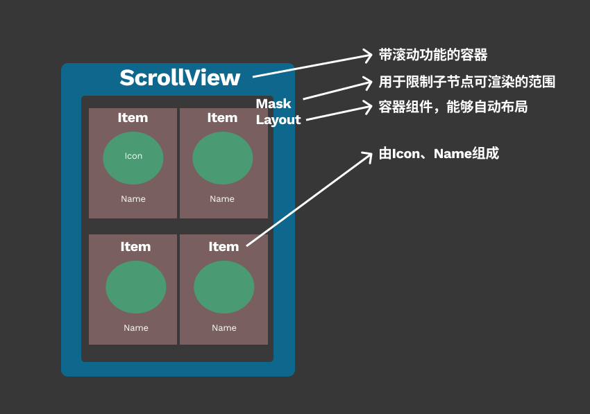

# 图鉴

休闲小游戏中通常会有图鉴概念来增加收集乐趣！
## 界面结构图

## 注意⚠️
如果Item过多，比如有1000个，一次性都加载出来，CPU压力会很大，容易出现**卡顿**现象。
## 解决方案
如上图所示，Item最多能同时被看到的个数是**6**，所以实际上只要生成6个预制体（Prefab）就够了，重复利用Item，避免全部加载造成**卡顿**及**内存**浪费！
## 工程地址
[ScrollViewPro](https://github.com/u6fe0/Hyper-Casual-Games-Dev-Guide/blob/main/Example/Cocos-Creator/ScrollViewPro/README.md)